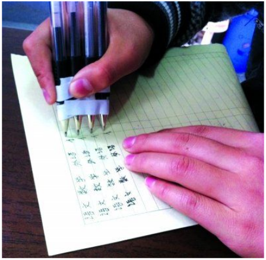

## 循环

​	循环变量初始化【var i = 1】

​	循环条件的判断【i <= 100】

​	循环变量的改变【i = i + 1; i++;】

 ☞  循环：  重复的再做一件事件

 	✔ 当条件满足的时候，执行循环代码
    ✔ 条件不满足的时候，不会执行循环代码

​    三要素：变量初始化，循环条件判断，循环变量的改变



## while循环

目的：用循环重复的执行一段代码

##### 语法

```javascript
while(条件表达式) {
    代码（循环体）
}

//循环变量初始化：（定义一个变量给其初始化一个值）var n = 1;
//循环条件的判断：（作为循环是否继续执行的判断）n <= 100;
//循环变量的变量：（让变量改动，这样就能够避免让循环无限制执行） n = n + 1;
var i = 1;
while ( i <= 100 ) {
	// 循环体【一堆代码】
    document.write('李寻欢');
	i++;
}
执行：
循环变量初始化==>条件判断（true）==>循环体(i++)==>条件判断（true）==>循环体(i++)==>条件判断（false）==>跳出循环
```

### 执行过程

 1.  先条件判断结构是 true 还是 false
 2.  如果是true，那么程序会一直执行循环体中的代码
 3.  如果条件为false，那么程序会立即跳出循环体代码结束执行


## do .. while 循环

### 语法

```javascript
do {
    循环体代码
}while(条件表达式)
循环体==>条件判断（true）==>循环体==>条件判断(true)==>循环体==>条件判断(false)==>跳出循环
```

### 执行过程

 ☞ 先执行循环体代码
 ☞ 然后判断条件
 ☞ 如果条件为true，继续执行循环体代码
 ☞ 如果条件为false,循环体代码立即结束，跳出循环

 与while循环的区别：
 1. 如果条件不满足，do while循环会比while循环多执行一次
 2. 如果条件满足，do while循环和while循环执行的次数是一样一样的。


## for循环

### 语法

for (var i = 1; i <= 100; i++) { //循环体 }

```javascript
☞  如果能明确循环次数，推荐使用for循环， 如果循环次数不确定，可以使用while获取do while循环
for (变量初始化; 条件表达式 ;  变量自增（变量自减）) {
     循环体代码
}

for(变量初始化;条件判断;变量改变){//循环体}

初始化变量==>条件判断(true)==>循环体==>变量改变==>条件判断（true）==>循环体==>变量改变==>条件判断（false）==>跳出循环
```

### 执行过程

1. 先执行变量初始化
2. 条件判断，结构是否为true
3. 如果条件为true，进入循环体中执行代码 【如果条件为false，循环立即结束】
4. 变量自增或自减  --   条件判断   --  true  --- 执行代码

### 案例演示


思考


## continue语句

### 特点

当程序遇到continue的时候，会结束本次循环，后面的代码也不会执行。进入到下一次循环中。

## break语句

### 特点

当程序遇到break语句的时候，程序会立即终止，后面的代码不执行


循环的执行过程

for循环：for (var i = 1; i < n; i++) {循环体}


如果循环次数不确定：while，do，while

循环次数确定：for


break和continue

break：跳出整个循环，continue：跳出当前循环继续下次循环

## 数组

 思考如果我们希望同时保存多条数据该怎么办？【例如：如何将班上所有学生姓名保存起来】
 多个数组组合

### 学习数组的意义？

 数组： 可以一次保存多条数据， 数组也是一个用来保存数据的容器。

### 创建数组

#### 构造函数创建数组（不讲）

```javascript
 var   自定义数组名称  = new Array();
```

#### 字面量创建数组

````javascript
var  自定义数组名称 = [] ;
````

### 数组赋值

#### 创建数组并赋值

```javascript
 ☞ 构造函数方式
 	  var  ary = new  Array (1,2,3,5,6);

 ☞ 字面量方式赋值
 	 var  ary = [1,2,3,4,6];
```

通过索引方式赋值

```javascript
var  ary = [];
ary[0]=1;
ary[1]=2;

因为数组是一个整体，我们要想获取，里面的某一个值，需要用下标（索引值）
数组：[20,22,36,19,26,18]
下标：[0, 1, 2, 3, 4, 5]
取值：数组[下标]
赋值：数组[下标] = 值；
最小下标：0，最大下标：数组.length - 1
总结：
  	1. 数组中索引值是从 0 开始的
    2. 通过索引的方式给数组赋值，要按照顺序个数设置
    3. 通过  数组名.length 可以获取到当前数组的长度
```

### 获取数组中的值

```javascript
☞  通过索引的方式获取数组中的值，数组的索引从0开始

☞  语法：
	    数组名[索引号]

例如：
	   var  ary = [1,2,3,4,5];
	   ary[0];
	   ary[1];
```

## 数组遍历

- 练习1：统计班级学生就业薪资，计算总薪资 和 平均薪资。

- 练习3：给一个不重复的数字数组，求最大值和最大值的在数组中的位置

  【作业】

- 练习4：给一个不重复的数字数组，求最大值和最大值的在数组中的位置 和 最小值和最小值的在数组中的位置

- 练习2：统计班级学生就业薪资，计算薪资超过15000的人的个数。【作业】

- 练习5：给一个字符串数组，将数组中的每一个数据拼接在一起，每个数据之间用 | 符合拼接。 如： ‘张三|李			四|王五’

- 练习6：给一个数字数组，该数组中有很多数字0，将不为0的数据存入到一个新的数组中【作业】

- 练习7：给一个数组，将数组中的数据反转，存放到一个新的数组中。
arr[arr.length] = 数据;


## 获取数组中的值-二维数组

```javascript
var arr = [
	[1,2,3],
	[4,5,6],
	[7,8,9]
];
第一行：1[0][0],2[0][1],3[0][2]
第二行：4[1][0],5[1][1],6[1][2]
第三行：7[2][0],8[2][1],9[2][2]
```

js没有二维数组的说法，但原理是二维数组，叫复杂数组

### 数组遍历

```javascript
for循环遍历数组	var arr = [
		[1,2,3],
		[4,5,6],
		[7,8,9]
];
```

```javascript
// 【案例】----------求二维数组的和
        var arr = [
                    [1, 2, 3],
                    [4, 5, 6],
                    [7, 8, 9]
                ];
        var sum = 0;
        for(var i = 0; i < arr.length; i++) {//外面的i是大数组下标
            // 因为arr[i]分别是三个小数组，不可以直接加
            // console.log(a[i]);
            // 再遍历小数组arr[i]
            for(var j = 0; j < arr[i].length; j++){//j代表小数组下标
                //因为arr[i]是数组，我们把这个想成一个整体数组，数组[j]
                //arr[i][j];
                // alert(a[i][j]);
                sum = sum + arr[i][j];
            }
        }
        document.write(sum);
```

## 冒泡排序

排序：有序排列【从小到大，从大到小】

逻辑：有两个水杯（一个5升，一个6升），还有无限的水；要求：让一个杯子装3升水

冒泡排序：

​	1、确认一个数组能够交换多少趟才可以得出结果【长度-1】

​	2、每一趟比较次数是多少次【长度-趟数】

​	3、把数组的前一个和后一个数比较，如果前一个数大于后一个数，那么就去交换位置

## 冒泡排序-案例

1. 给一组数字数组，将该数组中的数据排序（按照从小到大的规则） 冒泡排序
☞ 排序：按照从小到大方式排序(升序)  |  按照从大到小排序（降序）

2. 冒泡排序

	 ✔ 比较  	（遍历）
   ✔ 交换位置   （找一个中间变量）

```javascript
// 排序分析过程
       // 第1趟  5次   第1趟比较次数 = 数组长度 - 趟数
       // 第2趟  4次   第2趟比较次数 = 数组长度 - 趟数
       // 第3趟  3次   第3趟比较次数 = 数组长度 - 趟数
       // 第4趟  2次   第4趟比较次数 = 数组长度 - 趟数
       // 第5趟  1次   第5趟比较次数 = 数组长度 - 趟数
       // 趟数+次数=数组长度

        // 分析结论：
        // 1、趟数：数组长度 - 1
        //2、每次比较次数 = 数组长度 - 趟数
        //3、每次比较如果前面的大于后面的就要交换位置

        // 本题过程：
        // 比较趟数：要想比较出来结果，要比较数组长度-1趟才会出现最后的结果
        //每次比较次数 = 数组长度 - 趟数
        // 两两比较,如果前面的大于后面的，交换位置

        var arr = [56, 89, 99, 75, 97, 88];
        // 1、要确定比较多少趟才能出结果
        // 2、要确定每趟比较次数
        // 3、两两比较
        for(var i = 1; i <= arr.length - 1; i++) {//i代表趟数

            //次数
            for(var j = 0; j < arr.length - i; j++) {//j代表次数
                // 用j再当做数组下标
                // 比较
                if(arr[j] > arr[j + 1]){ //若前大于后面的
                    //交换
                    var t = arr[j];
                    arr[j] = arr[j + 1];
                    arr[j + 1] = t;
                }
            }
       }
       document.write('最后的排序结果为：'+ arr);
```

#### 案例：小娜功能
